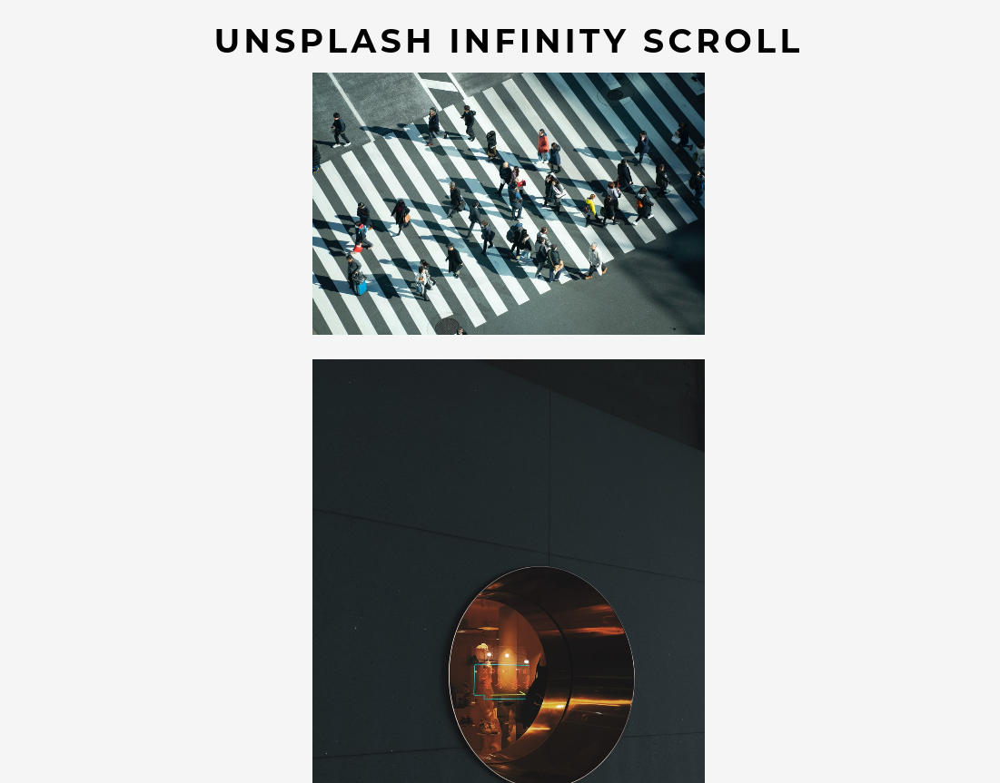

# Infinity Scroll

### Sobre
Essa aplicação emula a feature denominada _scroll infinito_ muito comum no feed de redes sociais e aplicativos. Sempre que o usuário se aproxima do fim do conteúdo previamente carregado, uma nova requisição é feita ao servidor e, suavemente, mais informações são exibidas.
No caso desse projeto, foi utiliza-da a API do Unsplash para preencher o feed com imagens.

### Aprendizados
Durante o desenvolvimento desse projeto me aprofundei um pouco mais com operações assíncronas e aprendi a utilizar [Async Functions](https://developer.mozilla.org/en-US/docs/Web/JavaScript/Reference/Statements/async_function). Além disso conheci as propriedades [window.scrollY](https://developer.mozilla.org/en-US/docs/Web/API/Window/scrollY) e [window.innerHeight](https://developer.mozilla.org/en-US/docs/Web/API/Window/innerHeight) além de outros atributos e métodos de objetos da DOM que foram importantes para estruturar a lógica do scroll infinito.

### Screenshot
