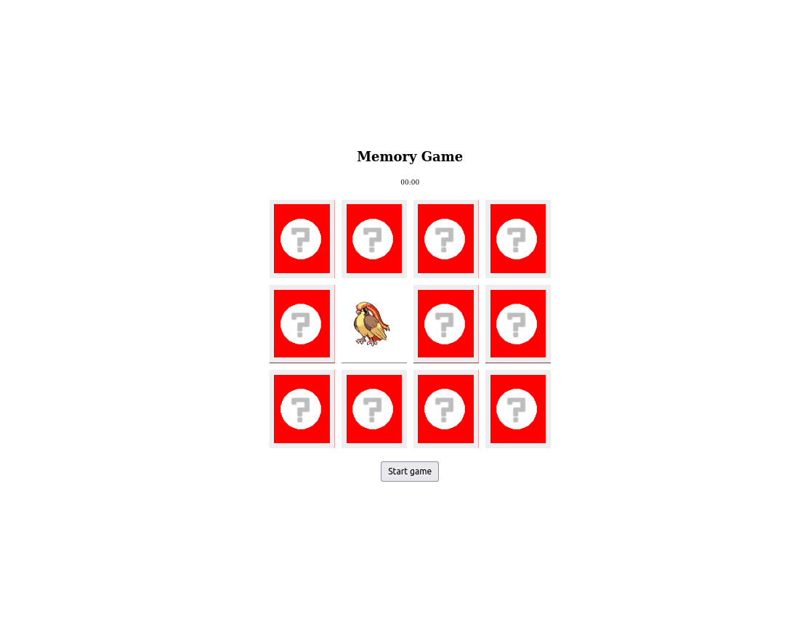

# Memory Game

### Sobre
Esta aplicação trata-se de um jogo da memória inspirado no jogo Memory Blocks lançado originalmente para o Windows 3.x em 1991.

### Aprendizado
Nesse projeto aprofundei um pouco mais minha habilidade de ler e utilizar uma Third Party API. No caso, utilizei a PokeAPI para popular cada par de cartas do jogo da memória com a imagem de um pokémon aleatório. Além disso conheci o método [all](https://developer.mozilla.org/en-US/docs/Web/JavaScript/Reference/Global_Objects/Promise/all) do objeto Promise, essencial para tratar a lista de promessas provenientes das prévias requisições solicitadas ao servidor.

### Screenshot
