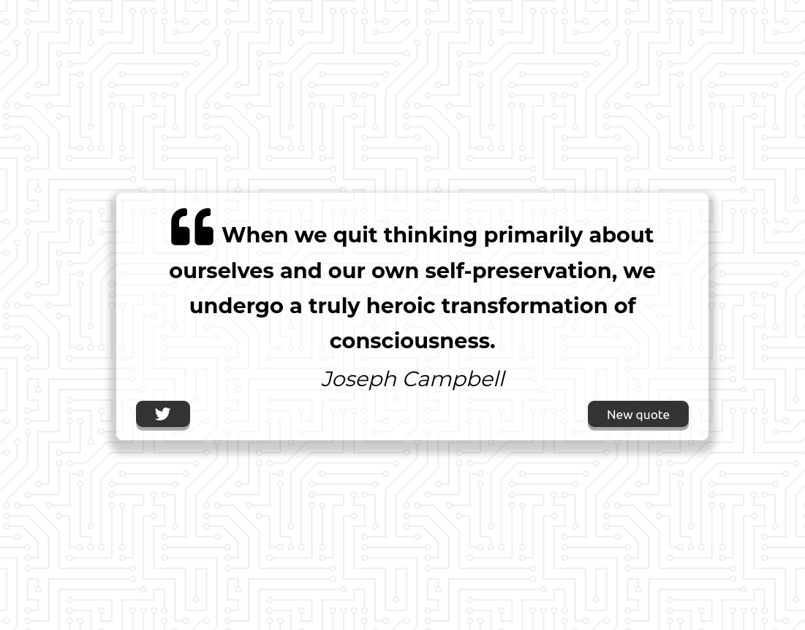

# Quote Generator

### Sobre
Esta aplicação trata-se de um gerador de frases aleatórias. A ideia partiu de um dos módulos do curso [JavaScript Web Projects](https://www.udemy.com/course/javascript-web-projects-to-build-your-portfolio-resume/) da ZTM Academy.

### Aprendizados

Com esse projeto aprendi o que são promises e funções assíncronas em JavaScript. Tal aprendizado foi aplicado para consumir dados de uma Third Party API que provê as frases exibidas pela aplicação.

### Screenshot

