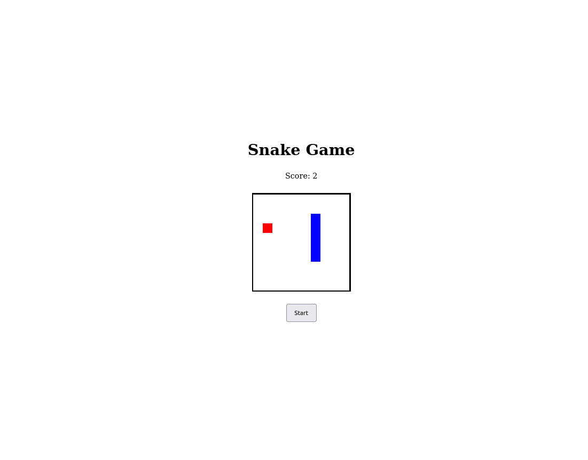

# Snake Game

### Sobre
Esta aplicação trata-se de um clone do clássico Jogo da Cobrinha popularizado pelo celular Nokia 3310.

### Aprendizados
Através desse projeto pude aprofundar meu entendimento quanto ao conceito de callBacks, conheci as funções [setInteval](https://developer.mozilla.org/en-US/docs/Web/API/setInterval) e [clearInterval](https://developer.mozilla.org/en-US/docs/Web/API/clearInterval), o evento [keyup](https://developer.mozilla.org/en-US/docs/Web/API/KeyboardEvent/key) e o atributo [key](https://developer.mozilla.org/en-US/docs/Web/API/KeyboardEvent/key).

### Screenshot
