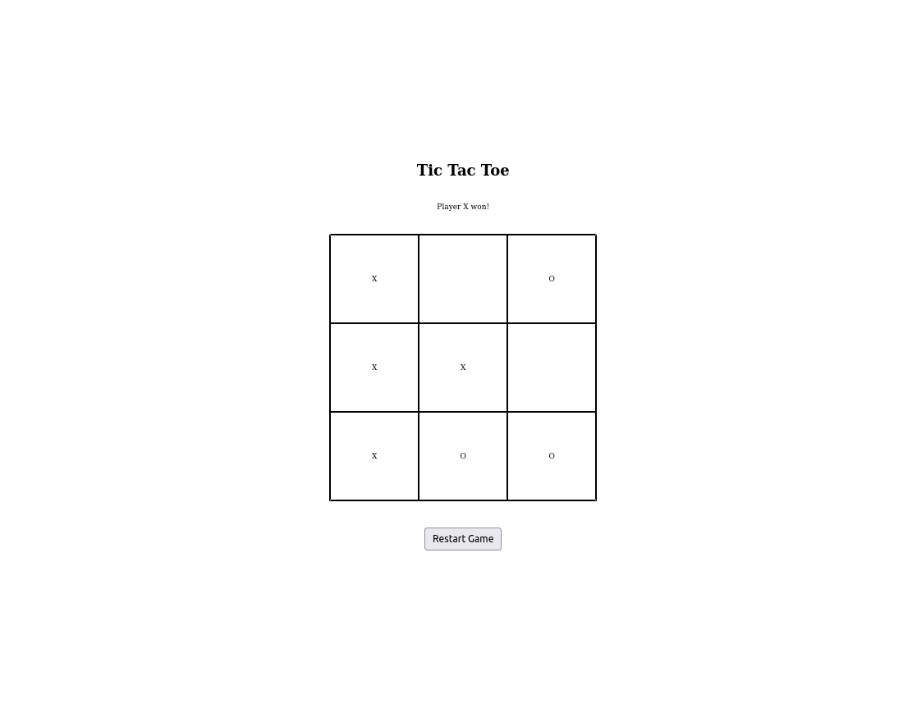

# Tic Tac Toe

### Sobre
Este projeto trata-se do clássico muito popular nas últimas páginas do caderno da escola, o Jogo da Velha.

### Aprendizados
Do ponto de vista da linguagem não houveram surpresas com esse projeto, porém foi desafiador no âmbito da lógica, pois precisei estruturar as combinações de vítoria dentro de um array bidimensional.

### Screenshot
